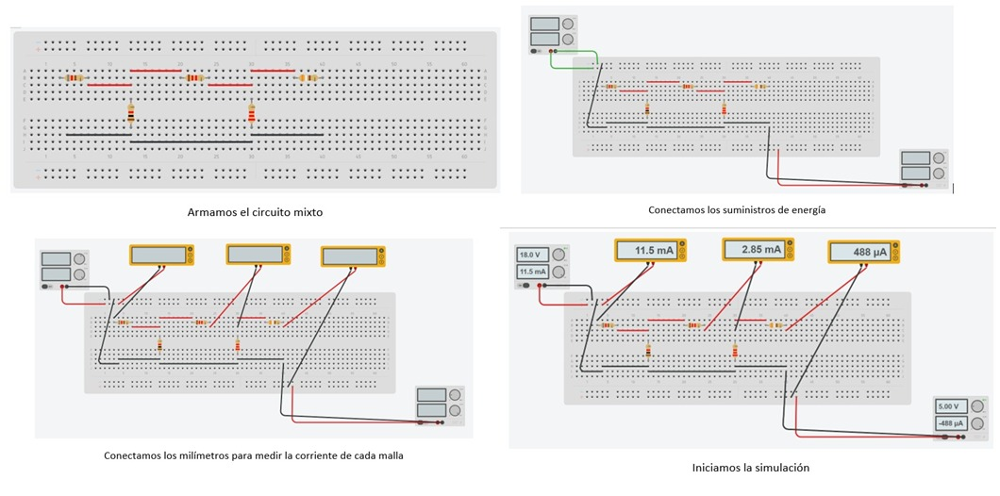
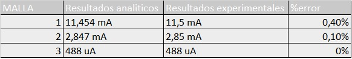

# PR-CTICA-No.-2-ANALISIS DE MALLAS

# Informe 

1. OBJETIVOS 

1.1. OBJETIVO GENERAL

-Determinar  analitica y experimentalmente el metodo de mallas para encontrar el valor de las diferentes tensiones que se encuentren en un circuito.

 1.2. OBJETIVO ESPECIFICO

- Diseñar el circuito usando la herramienta de tinkercad para poder tener una simulacion mas  real y compleder la corriente encerrada en cada malla que cuente el circuito.
- Analizar corriente de cada malla con ayuda de las leyes de Kirchhof al momento de encontrar las ecuaciones para los calculos.
- utilizar un multimetro para medir en el simulador los valores que arroja cada corriente y comparar con las obtenidas analiticamente para asi verificar si existe un margen de error.

2. MARCO TEORICO

3. DIAGRAMAS

A continuación armaremos el circuito en la aplicacion de tinkercad

4. LISTA DE COMPONENTES

| CANTIDAD|MATERIAL O EQUIPO|
| ----- | ---- |
|1|Fuente de voltaje de C.D|
|1|Multimetro digital|
|1|Resistor de 820  Ω|
|1|Resistor de 390 Ω|
|1|Resistor de 1kΩ|
|1|Resistor de 1.2kΩ|
|1|Resistor de 2.2kΩ|
|1|Protoboard|

Tambien se utilizo tinkercad que nos sirvio como laboratorio virtual.

5. EXPLICACION 

El metodo de analisis de mallas nos es de gran utilidad al poder analizar cada malla que se encuentre en el circuito por separado y asignar a cada malla una corriente total que se llega a calcular con la ley de voltajes de Kirchhof ya que en esta enuncia que la sumatoria de voltajes es igual a 0, aqui tambien nos ayudaoms de la ley de ohm recordando que v=RI y reemplazamos en la LVK, debemos tomar en cuenta el sentido que le damos a las corrientes ya que de esta dependera el signo que tome, una vez hecho este analisis y tener las ecuaciones de cada malla se puede calcular de varios metodos de sistemas de ecuaciones o podemos armar nuestra matriz y resolverla como una matriz ampliada, tambien se puede ocupar diferentes programas que resuelvan matrices o utilizando la calculadora, y asi finalmente nos el valor de cada corriente.

Tabla 2.1 Resultados obtenidos para el circuito

Como se puede ver en la tabla, se encuentra los valores experimentales y teoricos, esta claro que no vamos a tener un mayor margen de erro ya que estamos utilizando un simulador virtual, si fuera armado en fisico el margen de error seria un poco mas grande pero en este caso no es asi.

6. CONCLUCION 

- Se pudo encontrar el valor de cada corriente que interactua en cada malla mediante un analisis analitico utilizando conceptos antes vistos como las leyes de Kirchhof y aplicar lo que nos dice al analisis de mallas y encontrar el valor teorico.
- La herramienta de tinkercad con ayuda de un multimetro son arrojan un valor experimental de las corrientes y las podemos comparar con el valor teorico para encontrar su margen de error aunque si bien es cierto que el error sera minimo al utilizar una herramienta virtual, si se pudo sacar su error porcentual.

7. BIBLIOGRAFIA

Alvarez, H. (2017a, marzo 13). Mapa conceptual de análisis de malla. prezi.com. https://prezi.com/iqiank5jzqzy/mapa-conceptual-de-analisis-de-malla/

El método de la corriente de malla (artículo). (2015b, julio 3). Khan Academy. https://es.khanacademy.org/science/electrical-engineering/ee-circuit-analysis-topic/ee-dc-circuit-analysis/a/ee-mesh-current-method
